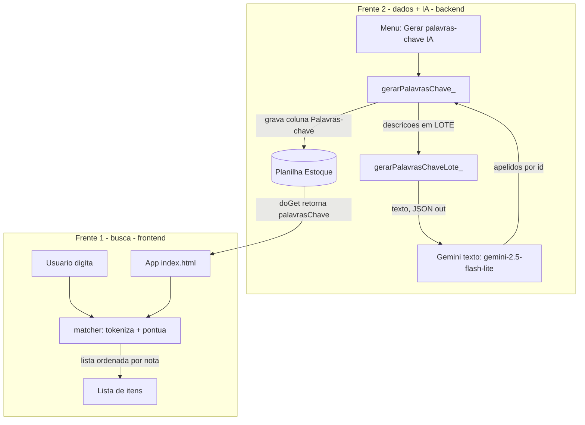

# Busca Inteligente + Palavras-chave (IA) — Design (o "como")

**Spec**: `.specs/features/busca-palavras-chave/spec.md`
**Status**: Draft (aguardando aprovação)

---

## 📖 Resumo em português simples (leia isto primeiro)

São **duas frentes** que se encaixam:

1. **Busca melhor (no app, `index.html`)** — em vez de procurar um pedaço de texto exato,
   o app passa a **quebrar a sua busca em palavras** e exigir que **todas** apareçam (em
   qualquer ordem), olhando descrição + código + código de barras + **palavras-chave**. E
   passa a **dar uma nota** para cada item e **ordenar pela nota** (o mais relevante no topo).

2. **Palavras-chave (na planilha + IA, `apps-script.gs`)** — criamos a coluna **"Palavras-chave"**.
   Um item de menu na planilha manda as descrições para a **IA de texto do Gemini** (barata) e
   ela devolve apelidos/sinônimos/categoria, que gravamos na coluna. A busca da frente passa a
   usar isso. Assim, buscar "spray" acha o `BORRIFADOR - AGUA...`.

A frente 1 é só frontend (nem republica backend). A frente 2 mexe na planilha e no backend.

---

## Architecture Overview

---

## Frente 1 — Busca nova (frontend `index.html`)

### Decisões
- **Campos buscáveis:** `descricao`, `codigo`, `codigoBarras`, `palavrasChave`. (Localização/
  unidade ficam de fora — o usuário não pediu; mantém a busca focada.)
- **Tokenização + E (AND):** a query é quebrada por espaços; cada palavra normalizada (reusa
  `norm()` em [index.html:771](../../../index.html)). Um item casa **se TODAS as palavras**
  aparecem no "texto de busca" do item (concatenação dos campos). → resolve ordem livre.
- **Ranqueamento (nota):** cada item recebe uma pontuação; a lista é ordenada por nota
  decrescente quando há busca. Como **código e código de barras são IDENTIFICADORES ÚNICOS**,
  um casamento neles é praticamente "achei ESTE item" e **domina** o ranking (match exato vai
  pro topo absoluto). Fórmula:
  | Sinal | Pontos |
  |---|---|
  | query inteira **igual** a `codigo` ou a `codigoBarras` (match único/definitivo) | +10000 |
  | `codigo`/`codigoBarras` **começa com** a query inteira (digitou parte do código) | +2000 |
  | `descricao` começa com a query inteira | +200 |
  | por palavra: casa como **palavra inteira** na descrição | +20 |
  | por palavra: casa nas **palavras-chave** | +12 |
  | por palavra: casa no **meio** de um campo (substring) | +5 |
  Empate → mantém o critério atual (alerta → localização → descrição).
  > Nota de design: a unicidade do código/código de barras é o sinal mais forte da busca —
  > por isso a diferença de ordem de grandeza (10000/2000 vs. dezenas) garante que ele sempre
  > vença um casamento de texto na descrição.
- **Função compartilhada (DRY):** criar `matchScore_(it, tokens)` (devolve nota ou -1 se não
  casa) e usar nos **três** pontos de busca que hoje repetem o mesmo `includes`: lista
  principal (`render`, [index.html:786](../../../index.html)), saída avulsa (`renderSaidaBusca`,
  [index.html:1352](../../../index.html)) e separação (`renderPickSearch`, [index.html:1158](../../../index.html)).
- **Não regredir:** busca vazia → comportamento atual (lista tudo + filtros + ordenação por
  alerta/localização). *Debounce* de 120ms mantido. Filtros mantidos.

### Modelo de item
`palavrasChave` entra no objeto do item (string), vindo do `doGet`, e é salvo no snapshot
(IndexedDB) como os demais campos.

---

## Frente 2 — Coluna + IA (backend `apps-script.gs`)

### A coluna
- Adicionar `{ key:'palavrasChave', label:'Palavras-chave' }` em `COLUMNS`.
- Adicionar aliases em `aliases_()`: `'palavras-chave'`, `'palavras chave'`, `'palavra-chave'`,
  `'apelidos'`, `'apelido'` → `palavrasChave`.
- Adicionar `'palavrasChave'` em `WANT_KEYS` para o `ensureColumns_` criar a coluna em planilhas
  já existentes (sem duplicar se já existir).
- `doGet` passa a devolver `palavrasChave: String(row[col.palavrasChave] || '')`.

### A IA de texto
- Constante `GEMINI_TEXT_MODEL = 'gemini-2.5-flash-lite'` (texto, barato; reusa `GEMINI_API_KEY`).
- `gerarPalavrasChaveLote_(descricoes)` → chama `…:generateContent` com:
  - `contents:[{parts:[{text: PROMPT_KW + lista numerada}]}]`
  - `generationConfig:{ responseMimeType:'application/json', temperature:0.2 }` (força JSON →
    parsing confiável).
  - Resposta em `candidates[0].content.parts[0].text` = JSON `[{ "id":n, "kw":"..." }]`.
  - Devolve um mapa `id → kw` (string). Em qualquer falha → devolve mapa vazio (rede de segurança).
- **PROMPT_KW (ancorado):** "Para cada descrição, gere 4–10 palavras-chave/sinônimos/nome
  popular/categoria que ajudem a achar o item numa busca. Português, minúsculas, separadas por
  vírgula. Baseie-se SOMENTE na descrição — não invente marca, modelo, voltagem ou tamanho.
  Responda em JSON: array de {id, kw}."

### O orquestrador + menu
- `onOpen` ganha item: **"3) Gerar palavras-chave (IA)"** → `gerarPalavrasChaveMenu`.
- `gerarPalavrasChave_()`:
  1. `getSheet_` (garante a coluna), `buildColMap_`.
  2. Varre as linhas; **seleciona** as que têm `codigo` e `descricao` preenchidos **e**
     `palavrasChave` **vazio** (idempotência: pula os já preenchidos).
  3. Processa em **lotes de ~25** (mapeando `id` = número da linha na planilha).
  4. Para cada lote chama `gerarPalavrasChaveLote_`; grava as células retornadas (escrita por
     célula/bloco). Itens sem retorno → ficam em branco (contam como falha).
  5. **Guarda de tempo:** se passar de ~5 min de execução, para com segurança (sem gravar item
     pela metade) e avisa "rode de novo para continuar".
  6. Retorna resumo `{ gerados, pulados, falhas }`.
- `gerarPalavrasChaveMenu` mostra o resumo num `alert`.
- `diagnosticarGeminiTexto()` (função avulsa, temporária) para confirmar custo/cota do modelo
  de texto antes do primeiro lote — mesmo padrão do `diagnosticarGemini` da feature de foto.

### Segurança / não-regressão
- Reusa `GEMINI_API_KEY` (Script Properties). Falha da IA nunca grava lixo nem trava (try/catch,
  mapa vazio → pula). Não toca em nenhuma outra coluna. Roda pela UI da planilha (sem `doPost`,
  sem lock).

---

## Reuses (aproveitar o que já existe)
- `norm()` (frontend) e `norm_()` (backend) para normalização.
- `buildColMap_`, `aliases_`, `ensureColumns_`, `getSheet_` para a coluna nova.
- Padrão de chamada `UrlFetchApp` + `muteHttpExceptions` + parse defensivo da feature de foto.
- Padrão de menu (`onOpen`, `…Menu` + `alert`) da feature "Atualizar Estoque".
- Padrão de função de diagnóstico (`diagnosticarGemini`).

## Riscos / pontos de atenção
- **Limite de 6 min:** mitigado por lote + guarda de tempo + idempotência (re-rodar continua).
- **Lote desalinhado** (IA devolve id a mais/menos): mapeamento por `id` explícito; id ausente → pula.
- **Custo:** confirmar com o diagnóstico (texto é barato; provável free tier — verificar).
- **Qualidade:** prompt ancorado reduz alucinação; usuário pode editar a coluna à mão depois.
