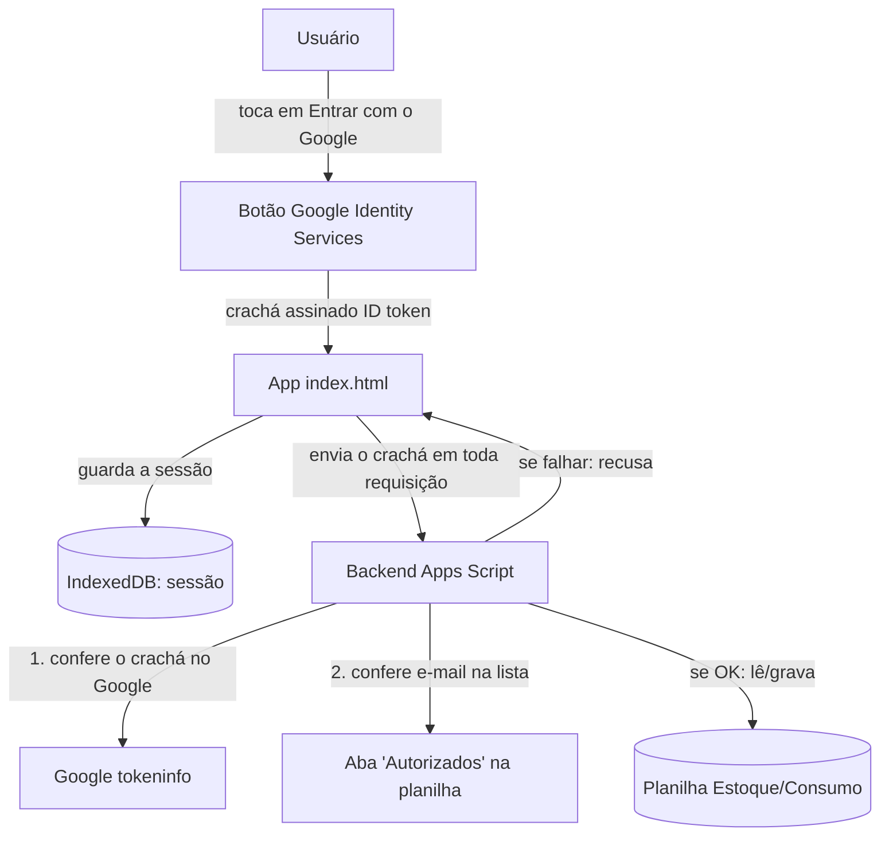

# Login com Google — Design (o "como")

**Spec**: `.specs/features/login-google/spec.md`
**Context**: `.specs/features/login-google/context.md`
**Status**: Draft (aguardando aprovação)

---

## 📖 Resumo em português simples (leia isto primeiro)

A ideia em 4 frases:

1. Colocamos o botão **"Entrar com o Google"** numa tela de login na frente do app.
2. Quando a pessoa entra, o Google devolve um **"crachá digital" assinado** (com o e-mail dela).
3. O app **guarda esse crachá no aparelho** (é assim que ele "lembra" e funciona offline) e
   o **envia junto** em toda conversa com o backend.
4. O **backend (Apps Script) confere o crachá** e vê se o e-mail está na sua **lista de
   autorizados** (uma aba nova na planilha). Se não estiver, recusa — mesmo que tentem pela URL.

Tem **uma preparação única no painel do Google** (criar uma "credencial" para o botão).
Eu te guio clicando, na hora de executar.

---

## Pré-requisito: configuração no Google Cloud (feita 1 vez, com orientação)

Antes de o código funcionar, é preciso criar uma credencial:

1. Acessar o **Google Cloud Console** → criar/escolher um projeto.
2. Configurar a **tela de consentimento** (nome do app, e-mail de suporte).
3. Criar um **ID do cliente OAuth 2.0** do tipo *Aplicativo da Web*.
4. Em **Origens JavaScript autorizadas**, adicionar a URL do app no GitHub Pages
   (ex.: `https://marcosporto.github.io`).
5. Copiar o **Client ID** gerado — ele entra no código (frontend e backend).

> Isso será uma tarefa guiada na fase de execução. Não é programação — são cliques.

---

## Architecture Overview



Fluxo de proteção (o ponto central): **nenhuma leitura ou gravação acontece sem um crachá
válido E um e-mail autorizado.** Isso fecha o ponto "API pública" do `CONCERNS.md`.

---

## Code Reuse Analysis

### Componentes existentes que vamos reaproveitar

| Componente | Localização | Como usar |
| ---------- | ----------- | --------- |
| Sistema de modais | `index.html` (`openModal`/`closeModal`) | Base para a tela/sobreposição de login |
| Armazenamento local | `index.html` (helpers `idbGet`/`idbPut`, store `kv`) | Guardar a sessão (crachá + e-mail) |
| Pipeline de rede/sync | `index.html` (`loadData`, `syncNow`) | Anexar o crachá nas chamadas já existentes |
| `esc()` | `index.html` | Exibir nome/e-mail com segurança |
| `jsonOut_`, `buildColMap_`, `getSheet_`, LockService | `apps-script.gs` | Resposta padrão, leitura de colunas, planilha |

### Pontos de integração

| Sistema | Como o login se conecta |
| ------- | ----------------------- |
| `doGet` (ler inventário/consumo) | Passa a exigir o crachá (parâmetro `token`) e validar antes de responder |
| `doPost` (todas as gravações) | Passa a exigir o crachá (campo `token` no corpo) e validar antes de gravar |
| Fila offline (`queue`) | No envio (`syncNow`), anexa o crachá atual a cada operação |

---

## Components

### 1. Tela de Login (frontend)
- **Purpose**: Bloquear o app e oferecer o botão "Entrar com o Google".
- **Location**: novo bloco em `index.html` (HTML da sobreposição + script GIS).
- **Interfaces**:
  - `handleCredentialResponse(resp)` — recebe `resp.credential` (o crachá/ID token).
  - `showLogin()` / `hideLogin()` — mostra/esconde a sobreposição.
- **Dependencies**: biblioteca `https://accounts.google.com/gsi/client`; `CLIENT_ID`.
- **Reuses**: estilos e padrão visual existentes.

### 2. Gerenciador de Sessão (frontend)
- **Purpose**: Guardar/ler/limpar a sessão e decidir se o app abre ou pede login.
- **Location**: novas funções em `index.html`.
- **Interfaces**:
  - `saveSession(token, email, name, exp)` / `getSession()` / `clearSession()`
  - `requireAuth()` — no `onload`: se há sessão lembrada → abre o app; senão → `showLogin()`.
  - `authToken()` — devolve o crachá atual para anexar às requisições.
  - `logout()` — limpa sessão + `google.accounts.id.disableAutoSelect()` + `showLogin()`.
- **Dependencies**: store `kv` do IndexedDB (chave `session`).
- **Reuses**: `idbGet`/`idbPut`/`idbDel`.

### 3. Guarda de Autenticação (backend)
- **Purpose**: Conferir o crachá e a autorização em toda requisição.
- **Location**: novas funções em `apps-script.gs`.
- **Interfaces**:
  - `verifyToken_(token)` → devolve `{ email, name }` se válido; senão lança erro.
  - `isAuthorized_(email)` → `true/false` consultando a aba `Autorizados`.
  - `requireAuth_(e, body)` → orquestra: extrai token, valida, autoriza; lança se falhar.
- **Dependencies**: `UrlFetchApp` (chamar o Google), `CacheService` (cache do resultado),
  `CLIENT_ID`, aba `Autorizados`.
- **Reuses**: `jsonOut_`, `norm_`.

### 4. Registro de Autoria (backend) — atende P2
- **Purpose**: Gravar o e-mail de quem fez cada ação.
- **Location**: ajustes em `pushItem_` e `addConsumo_` em `apps-script.gs`.
- **Interfaces**: gravam o e-mail (vindo de `requireAuth_`) nas novas colunas.
- **Reuses**: `buildColMap_`, `ensureColumns_`.

---

## Data Models

### Sessão (no aparelho — IndexedDB, store `kv`, chave `session`)
```
session = {
  token: string,   // o crachá (ID token JWT) devolvido pelo Google
  email: string,   // e-mail da pessoa (lido do crachá, só para exibir)
  name:  string,   // nome (só para exibir)
  exp:   number    // quando o crachá expira (para saber quando relogar)
}
```

### Lista de autorizados (nova aba `Autorizados` na planilha)
| E-mail | Nome (opcional) |
| ------ | --------------- |
| fulano@udesc.br | Fulano |

> Decisão coerente com o `context.md`: a lista é **gerenciada direto na planilha** —
> fácil para o responsável adicionar/remover sem mexer em código.

### Colunas novas de autoria
- Aba **Estoque**: nova coluna **"Conferido por"** (e-mail de quem confirmou).
- Aba **Consumo**: nova coluna **"Registrado por"** (e-mail de quem lançou a saída).

---

## Error Handling Strategy

| Cenário | Tratamento | O que o usuário vê |
| ------- | ---------- | ------------------ |
| Sem crachá / crachá inválido (online) | Backend recusa; app limpa sessão | Volta para a tela de login |
| E-mail fora da lista | Backend recusa | "Sua conta não tem permissão. Fale com o responsável." + logout |
| Offline e nunca logou | App não consegue logar | "É preciso internet no primeiro acesso." |
| Offline com sessão lembrada | App funciona normalmente | Usa o app; alterações entram na fila |
| Crachá expirou enquanto offline | Sync espera | Avisa que vai sincronizar após novo login online |
| Login cancelado/falhou | App permanece na tela de login | Mensagem amigável, sem travar |

---

## Tech Decisions (apenas as não óbvias)

| Decisão | Escolha | Porquê |
| ------- | ------- | ------ |
| Como o backend confere o crachá | Endpoint **`tokeninfo`** do Google (via `UrlFetchApp`) + checar nós mesmos `aud` (= nosso Client ID), `iss`, `exp` e e-mail | O Apps Script não tem a biblioteca oficial de validação e validar a assinatura RS256 "na mão" ali é inviável. ⚠️ A doc do Google diz que `tokeninfo` **não é recomendado para alto volume** (pode ter limite de uso). Para este app interno de baixo volume é aceitável; usamos **cache** (`CacheService`) para não chamar a cada requisição. *Confirmar tolerância na execução.* |
| Evitar bloqueio de CORS | Enviar o crachá **no corpo** (POST) e como **parâmetro de query** (GET), nunca em cabeçalho personalizado | O app hoje já funciona assim (requisição "simples", sem *preflight*); cabeçalho custom dispararia um *preflight* que o Apps Script não trata bem |
| Onde guardar a lista de autorizados | Aba **`Autorizados`** na planilha | Fácil de o responsável editar; coerente com o `context.md` |
| Botão x One Tap | Começar só com o **botão** "Entrar com o Google" | Mais previsível; o "One Tap" (login automático) fica como ideia futura |
| Decodificar o crachá no frontend | Só para **exibir** nome/e-mail e saber a validade — **nunca** para segurança | A segurança real é sempre no backend |

---

## Como o design trata os pontos do CONCERNS.md

- **"API pública"** → **resolvido**: backend passa a exigir crachá válido + e-mail autorizado.
- **"index.html é um arquivo único grande"** → o login adiciona código; mitigação: manter
  tudo numa seção bem marcada (`/* ----- Autenticação ----- */`) e funções pequenas.
- **"versão duplicada"** → ao publicar, lembrar de subir `APP_VERSION` e o `CACHE` do `sw.js`
  juntos (e incluir a lib do Google no `SHELL` do Service Worker para funcionar offline).

---

## ⚠️ Pontos a confirmar na execução (honestidade técnica)

- Tolerância do endpoint `tokeninfo` para o volume real (se incomodar, migrar para
  validação local da assinatura — mais trabalhoso no Apps Script).
- URL exata do GitHub Pages para cadastrar como "origem autorizada".
- Domínio institucional da UDESC (se um dia quiserem trocar "lista" por "qualquer e-mail
  do domínio" — hoje está fora de escopo).
